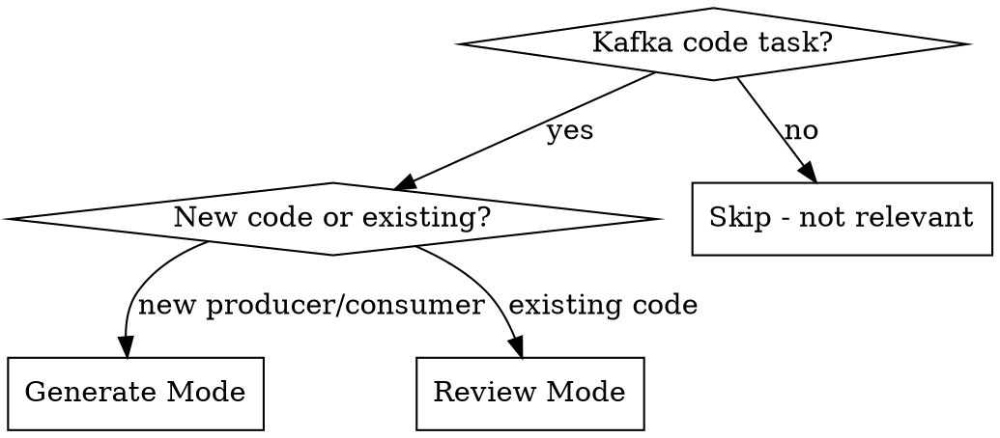

# Kafka Envelope Skill Implementation Plan

> **For agentic workers:** REQUIRED SUB-SKILL: Use superpowers:subagent-driven-development (recommended) or superpowers:executing-plans to implement this plan task-by-task. Steps use checkbox (`- [ ]`) syntax for tracking.

**Goal:** Create a Claude Code skill that generates and reviews Kafka producer/consumer code conforming to the CloudEvents-based envelope ADR.

**Architecture:** Two-file skill package — `SKILL.md` (< 400 words, workflows + checklist) references `envelope-spec.md` (full attribute reference, rules, examples, anti-patterns). Generate-mode scaffolds code with correct `ce_`-prefixed headers; Review-mode audits existing code against MUST/SHOULD/MAY rules.

**Tech Stack:** Claude Code Skill (Markdown), CloudEvents Kafka Protocol Binding, language-agnostic

**Spec:** `docs/superpowers/specs/2026-04-01-kafka-envelope-skill-design.md`

---

## File Structure

| File | Responsibility |
|---|---|
| `kafka-envelope/SKILL.md` | Frontmatter (trigger), overview, mode-decision flowchart, generate workflow, review workflow, checklist templates |
| `kafka-envelope/envelope-spec.md` | Attribut-Tabelle (MUST/SHOULD/MAY), ce_-prefix mapping, MUST/SHOULD/MAY-Regeln, vollstaendiges Message-Beispiel, Anti-Patterns |

---

### Task 1: Create envelope-spec.md reference file

**Files:**
- Create: `kafka-envelope/envelope-spec.md`

- [ ] **Step 1: Create the kafka-envelope directory**

```bash
mkdir -p kafka-envelope
```

- [ ] **Step 2: Write envelope-spec.md**

Create `kafka-envelope/envelope-spec.md` with the following content:

```markdown
# Kafka Envelope Specification

CloudEvents-compatible envelope for Kafka messages. Based on ADR "Kafka Message Struktur".
All CloudEvents attributes are transported in Kafka message headers with `ce_` prefix
(CloudEvents Kafka Protocol Binding, binary content mode).

## Attribute Reference

### Required (MUST)

| Attribute | Kafka Header | Type | Description | Example |
|---|---|---|---|---|
| id | `ce_id` | String (UUID) | Unique event ID. source + id must be globally unique. Does NOT identify the entity. | `44e149f7-8533-4d2c-814c-70e4fc8d4841` |
| source | `ce_source` | URI | Context in which the event occurs. Use business process context, NOT API endpoints or environments. | `https://netrtl.com/assets/asset-management` |
| specversion | `ce_specversion` | String | CloudEvents spec version. Always `1.0`. | `1.0` |
| type | `ce_type` | String | Describes the domain event (e.g. created, assigned, released). Must NOT imply entity-updates or snapshots. Version recommended. | `assets.material.asset-created.v1` |
| time | `ce_time` | Timestamp (RFC 3339) | Business timestamp of the event occurrence. NOT the infrastructure/Kafka timestamp. | `2025-04-12T23:20:50.52Z` |
| traceparent | `ce_traceparent` | String (W3C) | W3C Trace Context. Must be propagated or created if none exists. | `00-4bf92f3577b34da6a3ce929d0e0e4736-00f067aa0ba902b7-00` |

### Recommended (SHOULD)

| Attribute | Kafka Header | Type | Description | Example |
|---|---|---|---|---|
| correlationid | `ce_correlationid` | String (UUID) | Business correlation across system/service/topic boundaries. Propagate if business process context exists. | `2b9e7524-bbd9-469e-a510-95c10795d561` |
| causationid | `ce_causationid` | String | ID of the causing event. Must NOT be modified, must be forwarded. | See `id` |

### Optional (MAY)

| Attribute | Kafka Header | Type | Description | Example |
|---|---|---|---|---|
| datacontenttype | `content-type` | String (RFC 2046) | Media type of payload. Exception: NO `ce_` prefix. | `application/avro` |
| subject | `ce_subject` | String | Business identity + grouping for downstream filtering. | `small-material/287fc583-cc46-4d72-93ba-cad3640f1894` |
| messagekey | Kafka Message Key | String | Partitioning key, derived from subject. Not a header — it IS the Kafka message key. | `287fc583-cc46-4d72-93ba-cad3640f1894` |

## Rules

### MUST

1. Every Kafka message MUST contain an event envelope in message headers
2. Required attributes: id, source, specversion, type, time, traceparent
3. All CloudEvents headers MUST use `ce_` prefix. Exception: `datacontenttype` maps to `content-type` (no prefix)
4. All header values MUST be UTF-8 encoded strings
5. Message value MUST NOT contain technical metadata (tracing, correlation, governance)
6. `type` MUST describe a domain event (created, assigned, released) — no entity-updates or snapshots
7. Kafka messages MUST NOT be implicitly treated as events when they are entity-streams or snapshots
8. `messagekey` SHOULD be derived from `subject` to guarantee ordering per entity
9. `traceparent` MUST be propagated when a tracing context exists or can be created

### SHOULD

1. Set `correlationid` and propagate across system/service/topic boundaries
2. Set `causationid` when a causing event is identifiable
3. Version event types (e.g. `.v1`, `.v2`)

### MAY

1. Existing entity-streams may continue but MUST follow the envelope standard
2. Snapshots MUST be explicitly recognizable (via type or topic naming)
3. Additional metadata via CloudEvents extensions if justified and documented
4. Existing envelopes in message value should be migrated incrementally

## Complete Message Example

```
------------------ Message -------------------
Topic Name: assets.material.events

------------------- key ----------------------
Key: 287fc583-cc46-4d72-93ba-cad3640f1894

------------------ headers -------------------
ce_specversion: "1.0"
ce_id: "ca39745a-2b82-4097-9cdf-c40814492c1c"
ce_source: "https://netrtl.com/assets/asset-management"
ce_type: "assets.material.asset-created.v1"
ce_time: "2026-01-05T14:26:50.524Z"
ce_subject: "small-material/287fc583-cc46-4d72-93ba-cad3640f1894"
ce_traceparent: "00-4bf92f3577b34da6a3ce929d0e0e4736-00f067aa0ba902b7-01"
ce_correlationid: "287fc583-cc46-4d72-93ba-cad3640f1894"
ce_causationid: "44e149f7-8533-4d2c-814c-70e4fc8d4841"
content-type: "application/avro"

------------------- value --------------------
{
  "assetId": "287fc583-cc46-4d72-93ba-cad3640f1894"
}
-----------------------------------------------
```

## Anti-Patterns

| Anti-Pattern | Problem | Fix |
|---|---|---|
| Metadata in Avro payload | Mixes platform and domain, breaks schema evolution | Move metadata to Kafka headers |
| Headers without `ce_` prefix | Not CloudEvents-spec-compliant, breaks tooling | Add `ce_` prefix to all CloudEvents attributes |
| `type` as entity-update | e.g. "asset-updated" implies CRUD, not domain event | Describe the actual domain event |
| `source` as API endpoint | e.g. `/api/v1/assets` — source is context, not endpoint | Use business process context URI |
| `source` as environment | e.g. `production`, `staging` — source identifies context, not env | Use business context |
| `time` as infra timestamp | Kafka timestamp instead of business event time | Set business event timestamp |
| Missing idempotency | Consumer processes events multiple times without dedup | Use `ce_id` for deduplication |
| `datacontenttype` with `ce_` prefix | This attribute maps to `content-type` without prefix | Use `content-type` header |
```

- [ ] **Step 3: Verify the file reads correctly**

```bash
wc -l kafka-envelope/envelope-spec.md
```

Expected: approximately 100-110 lines.

- [ ] **Step 4: Commit**

```bash
git add kafka-envelope/envelope-spec.md
git commit -m "feat: add kafka envelope specification reference"
```

---

### Task 2: Create SKILL.md with frontmatter and overview

**Files:**
- Create: `kafka-envelope/SKILL.md`

- [ ] **Step 1: Write SKILL.md**

Create `kafka-envelope/SKILL.md` with the following content:

````markdown
---
name: kafka-envelope
description: >
  Use when writing or reviewing Kafka producer/consumer code,
  when Kafka client libraries are imported, or when event/message
  schemas are being designed for Kafka topics.
---

# Kafka Envelope

Ensures Kafka producer/consumer code follows the CloudEvents-based envelope standard.
Envelope attributes go in Kafka headers with `ce_` prefix; business payload stays in the message value.

## Modes



## Generate Mode

When creating a new Kafka producer or consumer:

1. Detect language/framework from project context (pom.xml, package.json, go.mod, etc.)
2. Determine if producer, consumer, or both are needed
3. Scaffold complete class with:
   - All MUST envelope headers (`ce_` prefixed) set correctly
   - Tracing propagation (`ce_traceparent`)
   - Avro serialization setup
   - Message key handling (derived from subject)
   - For consumers: header extraction, tracing context restoration, idempotency hint via `ce_id`
4. Read @envelope-spec.md for full attribute reference
5. Output compliance checklist after code generation:

```
Envelope Compliance Check:
  [x] id            — UUID generated
  [x] source        — derived from context
  [x] specversion   — 1.0
  [x] type          — event type defined
  [x] time          — RFC 3339 timestamp
  [x] traceparent   — W3C Trace Context propagated
  [ ] correlationid (SHOULD) — check if business context exists
  [ ] causationid   (SHOULD) — check if causing event is known
  [ ] messagekey    (optional) — check if partitioning needed
  [ ] subject       (optional) — check if filtering desired
```

## Review Mode

When reviewing existing Kafka producer/consumer code:

1. Identify producer/consumer classes in the code
2. Read @envelope-spec.md for rules and anti-patterns
3. Check each MUST/SHOULD/MAY rule
4. Output structured audit:

```
Kafka Envelope Audit: <ClassName>

MUST (violations block):
  [x] attribute — status
  [!] attribute — MISSING/WRONG, action needed

SHOULD (recommendations):
  [ ] attribute — not set, recommendation

MAY:
  [ ] attribute — not set, suggestion

Findings:
  [!] specific issue — fix description
```

Severity: `[!]` = MUST violation, `[ ]` = SHOULD/MAY gap, `[x]` = compliant.
````

- [ ] **Step 2: Count words to verify < 400**

```bash
wc -w kafka-envelope/SKILL.md
```

Expected: under 400 words (excluding frontmatter).

- [ ] **Step 3: Commit**

```bash
git add kafka-envelope/SKILL.md
git commit -m "feat: add kafka-envelope skill with generate and review modes"
```

---

### Task 3: Initialize git repo and make initial commit

**Files:**
- Modify: git configuration

Note: This task should be done BEFORE Tasks 1 and 2 if no git repo exists yet.

- [ ] **Step 1: Initialize git repository**

```bash
cd /Users/czarnik/IdeaProjects/skill-maker
git init
```

- [ ] **Step 2: Create .gitignore**

Create `.gitignore`:

```
.idea/
.DS_Store
```

- [ ] **Step 3: Initial commit with ADR and specs**

```bash
git add .gitignore kafka-message-struktur.md docs/
git commit -m "feat: add kafka message structure ADR and skill design spec"
```

---

### Task 4: Baseline test — Generate mode WITHOUT skill

**Files:**
- None (testing only)

This is the RED phase of TDD for skills. We test what Claude does WITHOUT the skill to identify gaps.

- [ ] **Step 1: Run baseline test with subagent**

Launch a subagent with this prompt (no skill loaded):

> "Create a Kafka producer in Java with Spring Kafka that publishes an event when an asset is created. The topic is `assets.material.events`. Use CloudEvents envelope in Kafka headers."

- [ ] **Step 2: Document baseline behavior**

Record in `docs/superpowers/specs/baseline-results.md`:
- Did the agent use `ce_` prefix on headers?
- Did it set all 6 MUST attributes?
- Did it use `content-type` (without prefix) for datacontenttype?
- Did it separate metadata from payload?
- Did it output a compliance checklist?
- What rationalizations or shortcuts did it take?

- [ ] **Step 3: Commit baseline results**

```bash
git add docs/superpowers/specs/baseline-results.md
git commit -m "test: document baseline behavior without kafka-envelope skill"
```

---

### Task 5: Baseline test — Review mode WITHOUT skill

**Files:**
- None (testing only)

- [ ] **Step 1: Create a deliberately non-compliant producer for testing**

Create `test-fixtures/BadProducer.java`:

```java
package com.example.assets;

import org.apache.kafka.clients.producer.ProducerRecord;
import org.apache.kafka.common.header.internals.RecordHeaders;
import org.springframework.kafka.core.KafkaTemplate;
import org.springframework.stereotype.Service;

import java.time.Instant;
import java.util.UUID;

@Service
public class AssetProducer {

    private final KafkaTemplate<String, byte[]> kafkaTemplate;

    public AssetProducer(KafkaTemplate<String, byte[]> kafkaTemplate) {
        this.kafkaTemplate = kafkaTemplate;
    }

    public void publishAssetCreated(String assetId, byte[] payload) {
        RecordHeaders headers = new RecordHeaders();
        // Anti-pattern: no ce_ prefix
        headers.add("type", "asset-updated".getBytes());
        // Anti-pattern: source as environment
        headers.add("source", "production".getBytes());
        // Anti-pattern: missing id, specversion, time, traceparent

        ProducerRecord<String, byte[]> record = new ProducerRecord<>(
            "assets.material.events",
            null,
            assetId,
            payload,
            headers
        );

        kafkaTemplate.send(record);
    }
}
```

- [ ] **Step 2: Run baseline review test with subagent**

Launch a subagent with this prompt (no skill loaded):

> "Review the Kafka producer in test-fixtures/BadProducer.java for compliance with CloudEvents envelope standards. Check all attributes and report issues."

- [ ] **Step 3: Document baseline review behavior**

Append to `docs/superpowers/specs/baseline-results.md`:
- Did the agent catch missing `ce_` prefix?
- Did it identify all missing MUST attributes?
- Did it flag `source` as environment anti-pattern?
- Did it flag `type` as entity-update anti-pattern?
- Did it produce a structured audit output?
- What did it miss?

- [ ] **Step 4: Commit**

```bash
git add test-fixtures/BadProducer.java docs/superpowers/specs/baseline-results.md
git commit -m "test: document baseline review behavior without kafka-envelope skill"
```

---

### Task 6: GREEN test — Generate mode WITH skill

**Files:**
- None (testing only)

- [ ] **Step 1: Run generate test with skill loaded**

Launch a subagent with the kafka-envelope skill loaded and this prompt:

> "Create a Kafka producer in Java with Spring Kafka that publishes an event when an asset is created. The topic is `assets.material.events`. Use the kafka-envelope skill."

- [ ] **Step 2: Verify against baseline gaps**

Check that every gap identified in Task 4 is now fixed:
- All `ce_` prefixes present
- All 6 MUST attributes set
- `content-type` without prefix for datacontenttype
- Metadata separated from payload
- Compliance checklist output after code generation

- [ ] **Step 3: Document results**

Create `docs/superpowers/specs/green-results.md` with comparison to baseline.

- [ ] **Step 4: Commit**

```bash
git add docs/superpowers/specs/green-results.md
git commit -m "test: verify generate mode with kafka-envelope skill (GREEN)"
```

---

### Task 7: GREEN test — Review mode WITH skill

**Files:**
- None (testing only)

- [ ] **Step 1: Run review test with skill loaded**

Launch a subagent with the kafka-envelope skill loaded and this prompt:

> "Review the Kafka producer in test-fixtures/BadProducer.java using the kafka-envelope skill."

- [ ] **Step 2: Verify against baseline gaps**

Check that every gap identified in Task 5 is now fixed:
- Structured audit output with MUST/SHOULD/MAY sections
- All missing MUST attributes flagged with `[!]`
- Missing `ce_` prefix detected
- `source` as environment anti-pattern caught
- `type` as entity-update anti-pattern caught

- [ ] **Step 3: Document results**

Append to `docs/superpowers/specs/green-results.md`.

- [ ] **Step 4: Commit**

```bash
git add docs/superpowers/specs/green-results.md
git commit -m "test: verify review mode with kafka-envelope skill (GREEN)"
```

---

### Task 8: REFACTOR — Close loopholes and finalize

**Files:**
- Modify: `kafka-envelope/SKILL.md`
- Modify: `kafka-envelope/envelope-spec.md`

- [ ] **Step 1: Identify gaps from GREEN tests**

Review green-results.md. For each remaining issue:
- Did the agent miss any attribute?
- Did it rationalize skipping something?
- Was the checklist format wrong?

- [ ] **Step 2: Update SKILL.md to address gaps**

Add explicit counters for any rationalizations found. Examples:
- If agent skipped `traceparent`: add "traceparent is REQUIRED even if no tracing framework is configured — create a new trace context"
- If agent forgot checklist: make checklist output more prominent in workflow

- [ ] **Step 3: Update envelope-spec.md if needed**

Add any missing clarifications or anti-patterns discovered during testing.

- [ ] **Step 4: Re-run both tests to verify fixes**

Repeat Task 6 Step 1 and Task 7 Step 1 with updated skill.

- [ ] **Step 5: Final word count check**

```bash
wc -w kafka-envelope/SKILL.md
```

Must be under 400 words.

- [ ] **Step 6: Commit**

```bash
git add kafka-envelope/
git commit -m "refactor: close loopholes in kafka-envelope skill after testing"
```

---

### Task 9: Package and document for distribution

**Files:**
- Create: `kafka-envelope/README.md`

- [ ] **Step 1: Create README for the skill package**

Create `kafka-envelope/README.md`:

```markdown
# kafka-envelope

A Claude Code skill for generating and reviewing Kafka producer/consumer code
that conforms to the CloudEvents-based envelope standard.

## Installation

Copy the `kafka-envelope/` directory to your Claude Code skills location:

- **Personal:** `~/.claude/skills/kafka-envelope/`
- **Project:** `.claude/skills/kafka-envelope/`
- **Plugin:** Follow the Claude Code plugin packaging guide

## Usage

The skill activates automatically when:
- Writing new Kafka producer/consumer code
- Reviewing existing Kafka code
- Kafka client libraries are imported in the project

Or invoke explicitly by referencing "kafka-envelope" in your prompt.

## Modes

- **Generate:** Scaffolds producer/consumer with correct CloudEvents headers
- **Review:** Audits existing code against MUST/SHOULD/MAY rules

## Source

Based on ADR "Kafka Message Struktur" — CloudEvents-compatible envelope
for Kafka messages with headers in binary content mode.
```

- [ ] **Step 2: Verify final package structure**

```bash
find kafka-envelope/ -type f
```

Expected:
```
kafka-envelope/SKILL.md
kafka-envelope/envelope-spec.md
kafka-envelope/README.md
```

- [ ] **Step 3: Final commit**

```bash
git add kafka-envelope/
git commit -m "docs: add README for kafka-envelope skill package"
```

---

## Execution Order

Tasks 3 (git init) must run first. Then Tasks 1-2 (create skill files). Then Tasks 4-5 (RED baseline). Then Tasks 6-7 (GREEN). Then Task 8 (REFACTOR). Finally Task 9 (packaging).

```
Task 3 (git init) -> Task 1 (spec) -> Task 2 (SKILL.md) -> Task 4 (RED generate) -> Task 5 (RED review) -> Task 6 (GREEN generate) -> Task 7 (GREEN review) -> Task 8 (REFACTOR) -> Task 9 (package)
```
