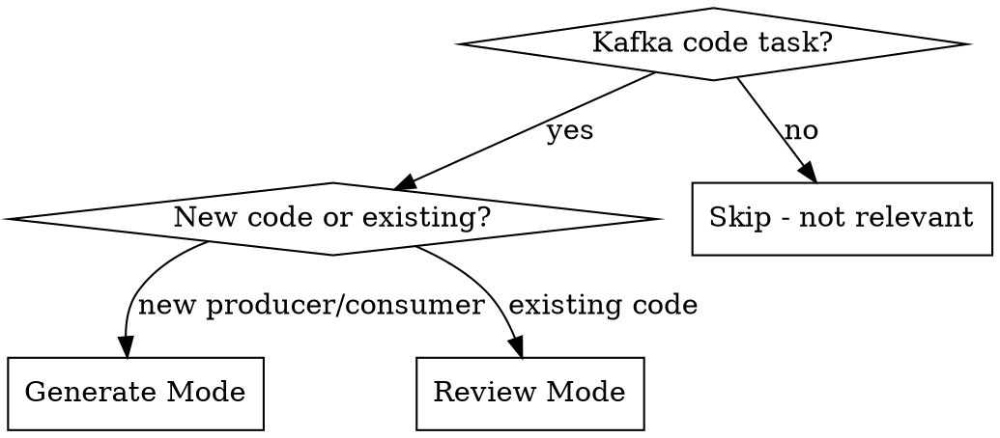

# Kafka Envelope

Ensures Kafka producer/consumer code follows the CloudEvents-based envelope standard.
Envelope attributes go in Kafka headers with `ce_` prefix; business payload stays in the message value.

## Modes



## Generate Mode

When creating a new Kafka producer or consumer:

1. Detect language/framework from project context (pom.xml, package.json, go.mod, etc.)
2. Determine if producer, consumer, or both are needed
3. Scaffold complete class with:
   - All MUST envelope headers (`ce_` prefixed) set correctly
   - Tracing propagation (`ce_traceparent`)
   - Avro serialization setup
   - Message key handling (derived from subject)
   - For consumers: header extraction, tracing context restoration, idempotency hint via `ce_id`
4. Read @envelope-spec.md for full attribute reference
5. Output compliance checklist after code generation:

```
Envelope Compliance Check:
  [x] id            — UUID generated
  [x] source        — derived from context
  [x] specversion   — 1.0
  [x] type          — event type defined
  [x] time          — RFC 3339 timestamp
  [x] traceparent   — W3C Trace Context propagated
  [ ] correlationid (SHOULD) — check if business context exists
  [ ] causationid   (SHOULD) — check if causing event is known
  [ ] messagekey    (optional) — check if partitioning needed
  [ ] subject       (optional) — check if filtering desired
```

## Review Mode

When reviewing existing Kafka producer/consumer code:

1. Identify producer/consumer classes in the code
2. Read @envelope-spec.md for rules and anti-patterns
3. Check each MUST/SHOULD/MAY rule
4. Output structured audit:

```
Kafka Envelope Audit: <ClassName>

MUST (violations block):
  [x] attribute — status
  [!] attribute — MISSING/WRONG, action needed

SHOULD (recommendations):
  [ ] attribute — not set, recommendation

MAY:
  [ ] attribute — not set, suggestion

Findings:
  [!] specific issue — fix description
```

Severity: `[!]` = MUST violation, `[ ]` = SHOULD/MAY gap, `[x]` = compliant.
